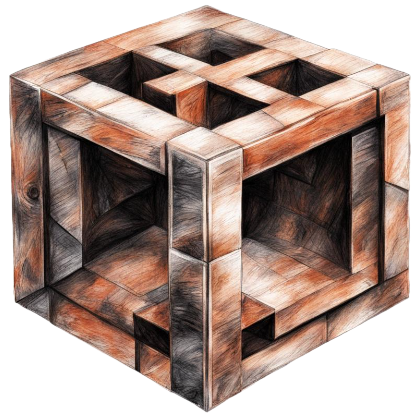

# Rusttesserast
[](https://crates.io/crates/rusttesserast)
[](https://docs.rs/rusttesserast)
[](https://github.com/spectrtrec/rusttesserast/actions/workflows/rust.yaml)
[](./LICENSE)
<p align="center">
  
</p>

## Overview
rusttesserast is a simple library providing the asynchronous methods for tesseract api in Rust.
See [documentation](https://docs.rs/rusttesserast) for more.
## Usage
Add this to your Cargo.toml:
```
[dependencies]
rusttesserast = "0.0.2"
```
```rust
use rusttesserast::tess_lib::TesseractApi;

#[tokio::main]
async fn main() {
    let mut tesseract_base = TesseractApi::new(Some(TesseractApi{dpi: 3, psm:3, ..Default::default()}), Some(String::from("/usr/local/share/tessdata").as_str()), Some(String::from("eng").as_str())).unwrap();
    let image_array = vec!["/workspaces/rusttesserast/tests/test_img.png", "/workspaces/rusttesserast/tests/test_img.png"];
    let test = tesseract_base.recognize_doc(None, None, image_array, "txt", None).await;
}
```
```rust
use rusttesserast::tess_lib::TesseractApi;

#[tokio::main]
async fn main() {
    let mut tesseract_base = TesseractApi::new(Some(TesseractApi{dpi: 3, psm:3, ..Default::default()}), Some(String::from("/usr/local/share/tessdata").as_str()), Some(String::from("eng").as_str())).unwrap();
    let image_array = vec!["/workspaces/rusttesserast/tests/test_img.png", "/workspaces/rusttesserast/tests/test_img.png"];
    let test = tesseract_base.recognize_doc(Some(String::from("test/save/path").as_str()), Some(String::from("test_data_file.txt").as_str()), image_array, "tsv", Some(true)).await;
}
```
## License
Licensed under MIT license.
